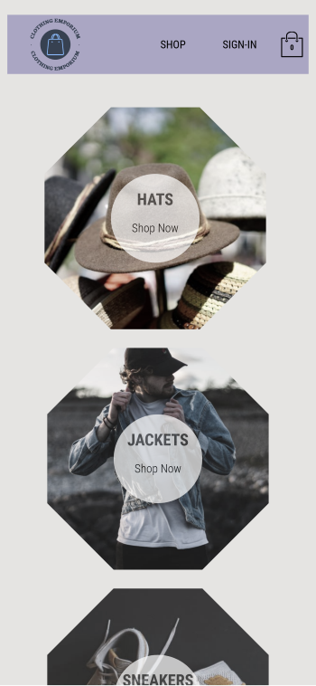

# Fully functional e-Commerce site with Redux Toolkit.

This is a full working project for the ZTM Complete React developer Course. The course went through a variety of technologies to build this project including react context and legacy Redux. What the course did not address was using Redux Toolkit or responsive design. I have implemented both in my project code to keep up with these very important aspects of front-end developement and to expand my own knowledge.

## Table of contents

- [Overview](#overview)
  - [The challenge](#the-challenge)
  - [Screenshot](#screenshot)
  - [Links](#links)
- [My process](#my-process)
  - [Built with](#built-with)
  - [What I learned](#what-i-learned)
  - [Continued development](#continued-development)
  - [Useful resources](#useful-resources)
- [Author](#author)
- [Acknowledgments](#acknowledgments)

## Overview

### E-Commerce Clothing Site Project

Users should be able to:

- Use directory to navigate to appropriate shop page.
- Sign-up or sign-in with password and email or with Google sign-in.
- Add individual items to cart.
- Be able to view all items in the dropdown cart.
- Be able to view all items in checkout page as well as add, subtract, or remove items from cart.
- View Total cost for all items

### Screenshot

### Links

- Solution URL: [Github-rep](https://github.com/PeshwariNaan/rtk-v2.git)
- Live Site URL: [Live-Link](https://frolicking-pasca-97775f.netlify.app)

## My process

### Built with

- [React](https://reactjs.org/) - JS library
- [React Router 6](https://github.com/remix-run/react-router/blob/main/docs/getting-started/tutorial.md)
- Firebase / Firestore
- [Redux Toolkit for state management](https://redux-toolkit.js.org/)
- CSS Grid
- Flexbox
- [Styled Components](https://styled-components.com/) - For styles

### What I learned

This project was a great start for learning and Firebase / Firestore. I had minimal exposure to Firebase in the past but this project taught me how to easily set up user authentiaction, sign-in/up with third party authorization, and create collections and documents in Firestore. In addition, I learned how to fetch data from different collections and work with maps and data arrays to display the data on the site.

I learned a great deal about state management using everything from React context, legacy Redux with Thunk and Sagas, as well as teaching myself Redux Toolkit. I have been using Redux for the last couple years but going back through the fundamentals and working through the advanced aspects again really helped solidify my knowledge and made learning RTK fairly easy. It was great to see the parallels of the different state management approaches to help me ba able to choose which one is a good fit for future projects.

Advancing my knowledge with React-router 6. I learned how to create nested routes and how to make the navigation elegant and compact.

### Continued development

There is always so much more to learn and this industry moves fast. For my continued developement at this point I see a lot of developers using Typescript and I want to become more proficient with this language. Im starting with migrating some existiing projects over to typescript to get the grasp of the fundamentals.

### Useful resources

- [Firestore-data-reference](https://cloud.google.com/firestore/docs/samples/firestore-data-reference-subcollection) - This helped me with understanding the syntax to query/create collections and documents and will definitely use it going forward with any firebase projects.
- [Redux Toolkit for state management](https://redux-toolkit.js.org/)

## Author

- Github - [J.D. Browne](https://www.your-site.com)
- Frontend Mentor - [@PeshwariNaan](https://www.frontendmentor.io/profile/PeshwariNaan)

## Acknowledgments

I would like to thank the people at ZTM for making some great courses and giving the opportunity for people everywhere to learn new skills that can change lives.
